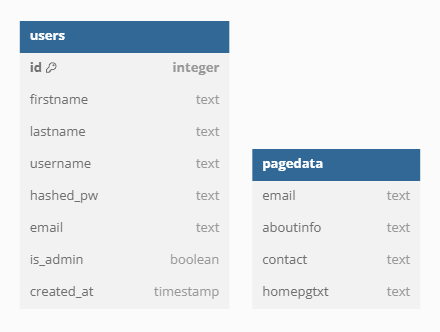

# FirmSearch

This website is for people looking for investment advice. All registered firms are located by relevant search terms and sent to SEC API. The response from the SEC is then parsed and relevant information is displayed in human, novice readable terms, judged by industry experts who can identify what information is most helpful for the average person.

## Website Link:

- https://advisory-evaluator.onrender.com

## Changes:

- Improved Search Result Accuracy
- Changed Search Bar orientation for large screens
- Consolidated Search Bar into single form, no more toggling for Advanced Searches
- Added User Ability to Save Firms
- Added Review Page
- Added Resource Page

## Fixes:

- Fixed an issue where no results would return when looking for a firm in Oregon.

## Database Layout:

- Each user has access to all site functions, logged in or otherwise.
- ONLY ADMINISTRATORS are able to Post, Delete, or Change relevant page data.
- All Users are capable of Saving a firm, this stores the firm on the saved firms table, so that if a user likes a certain firm and wants to come back later they can find it easier.

## Features:

- Users can select the state and city they live in and retrieve a list of firms in those parameters
- Clicking on a firm pulls up data about said firm and shows contact information, address, data about what that firm does and other relevant info helpful to make decisions.
- Certain fields are updatable by Admin users so site does not have to be pulled offline to update About or Home page information.
- Admins are the only ones allowed to manipulate data, anyone visiting the site that does not have an admin account can only search for and view information.

## Tech:

- React
- Node
- Postgres
- jsonwebtokens
- jsonschema
- bcrypt
- axios

## Future additions:

- Prettier Styling - Currently using very basic styles to ensure good functionality.
- Changes to ADV Forms coming.
- Name Change
