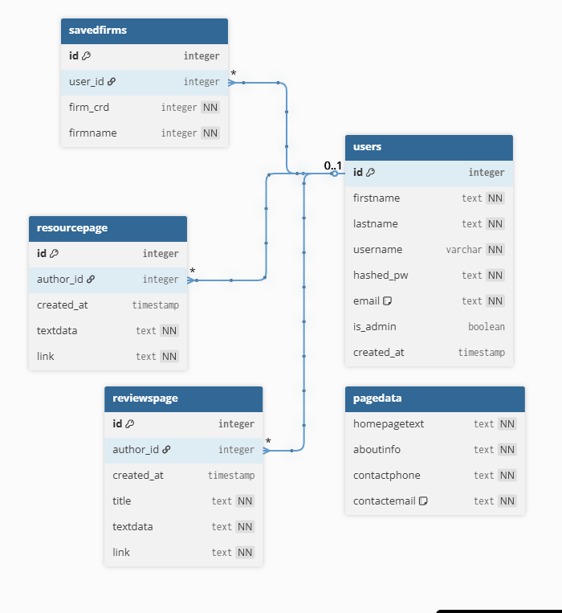

# FirmSearch

This website is for people looking for investment advice. All registered firms are located by relevant search terms and sent to SEC API. The response from the SEC is then parsed and relevant information is displayed in human, novice readable terms, judged by industry experts who can identify what information is most helpful for the average person.

## Database Layout:
- Database is only used for storing relevant text data as well as user data. No relations are required as any searched data is generated on demand.

## Features:

- Users can select the state, city, or zip code they live in and retrieve a list of firms in those parameters
- Clicking on a firm pulls up data about said firm and shows contact information, address, data about what that firm does and other relevant info helpful to make decisions.
- Certain fields are updatable by Admin users so site does not have to be pulled offline to update About or Home page information.
- Admins are the only ones allowed to manipulate data, anyone visiting the site that does not have an admin account can only search for and view information.

## Tech:

- React
- Node
- Postgres
- jsonwebtokens
- jsonschema
- bcrypt
- axios

## Future additions:

- More search fields
